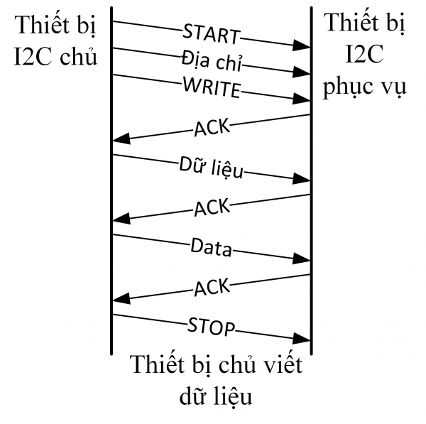
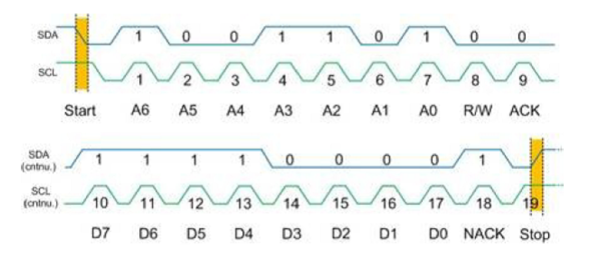
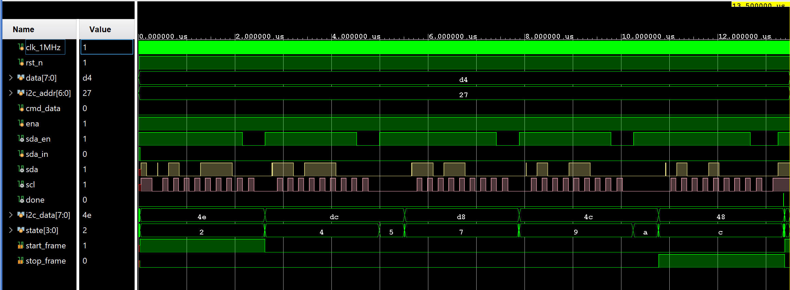

[Vietnamese version here!](./README_VI.md)

# LCD I2C Verilog Demo

A project demonstrating Verilog communication with an LCD via the I2C protocol.

## I. Author

- **Name:** Võ Nhật Trường
- **Email:** truong92cdv@gmail.com
- **GitHub:** [truong92cdv](https://github.com/truong92cdv)

## II. Demo Results


## III. Equipment

- ZUBoard 1CG with part number XCZU1CG-1SBVA484E
- LCD I2C module 16x2 (integrated IC **PCF8574**, I2C address 0x27).
- Two signal lines: SDA and SCL, VCC +5V, and GND wires.


## IV. I2C Protocol

Read more about the I2C protocol here [I2C protocol](https://dayhocstem.com/blog/2020/05/giao-dien-ghep-noi-i2c.html).

The I2C protocol consists of two signal lines: SDA and SCL. The SCL signal is a clock signal generated by the Master, while the SDA signal is used for data transmission and reception.
When the Master wants to write data to the Slave, the steps are as follows:
1. The Master sends the **START** signal (pulling SDA from high to low while SCL is held high).
2. The Master sends the address of the Slave to communicate with (an 8-bit frame consisting of 7-bit address + 1-bit write indicator).
3. The Slave compares the address; if it matches, it sends an **ACK** signal to indicate readiness to receive data from the Master (holding SDA low while SCL transitions from low to high on the 9th clock cycle).
4. The Master sends 1 byte of data. It writes each bit to SDA (MSB first) as SCL transitions from low to high.
5. The Slave sends an **ACK** signal. Steps 4 and 5 repeat until the Master has transmitted all the data.
6. The Master sends the **STOP** signal (pulling SDA from low to high while SCL is held high).

Remember that the SDA and SCL lines are bidirectional and must be connected to pull-up resistors (typically 4.7kΩ) to avoid signal conflicts. When the Master or Slave pulls the bus low, it sends a low-level signal. To pull the bus high, it releases the bus, allowing the pull-up resistor to pull it high.


Data transmission protocol when the Master wants to send data to the Slave:



Target waveform:



## V. Source Code

### [1. clk_divider](./src/clk_divider.v)

---

- Generates a 1 MHz clock (1 µs) from the ZUBoard's 100 MHz clock.

### [2. i2c_writeframe](./src/i2c_writeframe.v)

---

- First, design the **i2c_writeframe** module to write a frame (address or data).

- Flags **start_frame** and **stop_frame** indicate whether the current frame is the first (address frame with a **START** signal at the beginning) or the last (frame with a **STOP** signal at the end).

- The SDA signal is bidirectional and must be declared as a **tri-state buffer**, activated by the **sda_en** signal.

```
    // sda is a bidirectional tri-state buffer enabled by sda_en.
    // When sda_en = 1; if sda_out = 0, sda = 0; if sda_out = 1, sda is high impedance, allowing pull-up resistor pulls sda to 1.
    // When sda_en = 0; sda is high impedance, allowing read sda from the bus.
    assign sda = sda_en ? (~sda_out ? 1'b0 : 1'bz) : 1'bz;
    assign sda_in = sda;
```

- Modify the above code slightly in the testbench to display the waveform more clearly:

```
    // for simulation, we use those lines instead:
    assign sda = sda_en ? sda_out : 1'bz;
    assign sda_in = sda;
```

- The **i2c_writeframe** module is an **FSM** with 15 states, designed to create a complete transmission frame as shown:


Flowchart of the i2c_writeframe FSM:


- States **PreStart**, **Start**, **AfterStart** appear only when the **start_frame** flag is set.
- Similarly, states **PreStop** and **Stop** appear only when the **stop_frame** flag is set.
- States **WriteLow** and **WriteHigh** repeat 8 times (1 frame of 8 bits).

[Testbench code](./tb/i2c_writeframe_tb.v)

Testbench waveform:


Note that the first frame includes the **START** condition and the last frame includes the **STOP** condition.

### [3. lcd_write_cmd_data](./src/lcd_write_cmd_data.v)

---

This module sends commands or data to the LCD in 4-bit mode.

Read more about 4-bit mode LCD communication here [LCD 4bit mode](https://www.electronicwings.com/8051/lcd16x2-interfacing-in-4-bit-mode-with-8051).

Before sending data to the LCD, the following commands must be sent to initialize 4-bit mode:
1. Command **0x02**: set 4-bit mode.
2. Command **0x28**: set LCD to 16x2, 4-bit mode, 2 lines, 5x8 character format.
3. Command **0x0C**: set Display ON, cursor OFF.
4. Command **0x06**: auto increment cursor after writing a character.
5. Command **0x01**: clear the screen.
6. Command **0x80**: move the cursor to the beginning of line 1.

Steps to send a command or data include:
1. Set **RS = 0** (command) or **RS = 1** (data).
2. Set **RW = 0** (write mode).
3. Send the higher 4 bits to **D7 D6 D5 D4** of the LCD.
4. Send a High -> Low pulse to the **EN** pin to latch the data.
5. Send the lower 4 bits to **D7 D6 D5 D4** of the LCD.
6. Send another High -> Low pulse to the **EN** pin to latch the data.

Since commands (or data) are sent to the LCD via the PCF8574 IC, it's important to understand the module's schematic:


When sending a byte to the PCF8574, the data is output to corresponding pins:

- **P7  P6  P5  P4  P3  P2  P1  P0** (PCF8574 outputs)
- **D7 D6 D5 D4 BT EN RW RS** (LCD pins)

To send a command (or data) to the LCD in 4-bit mode, 5 frames need to be sent:
1. Set **start_frame** flag. Send the address frame (7-bit address + 1-bit write indicator).
2. Send data frame 1 (**D7 D6 D5 D4 1 1 0 RS**).
3. Send data frame 2 (**D7 D6 D5 D4 1 0 0 RS**), creating a High -> Low pulse on **EN** to latch the higher 4 bits.
4. Send data frame 3 (**D3 D2 D1 D0 1 1 0 RS**).
5. Set **stop_frame** flag. Send data frame 4 (**D3 D2 D1 D0 1 0 0 RS**), creating a second High -> Low pulse on **EN** to latch the lower 4 bits.

The **lcd_write_cmd_data** module is an **FSM** with 14 states:


[Testbench code](./tb/lcd_write_cmd_data_tb.v)

Testbench waveform:



### [4. lcd_display](./src/lcd_display.v)

---

Inputs **row1** and **row2** are character strings to display on line 1 and line 2, respectively. Each line consists of 16 characters × 8 bits = 128 bits.

Pay attention to the following code, which transfers data from **row1** and **row2** to the **cmd_data_array** array (40 bytes). This array contains the commands to write to the LCD:
1. Commands **0 -> 5**: LCD initialization commands.
2. Commands **6 -> 21**: data for line 1.
3. Command **22**: move the cursor to the beginning of line 2.
4. Commands **23 -> 38**: data for line 2.

```
    wire [7:0]  cmd_data_array [0:39];

    assign cmd_data_array[0]    = 8'h02;    // 4-bit mode
    assign cmd_data_array[1]    = 8'h28;    // initialization of 16x2 lcd in 4-bit mode
    assign cmd_data_array[2]    = 8'h0C;    // display ON, cursor OFF
    assign cmd_data_array[3]    = 8'h06;    // auto increment cursor
    assign cmd_data_array[4]    = 8'h01;    // clear display
    assign cmd_data_array[5]    = 8'h80;    // cursor at first line
    assign cmd_data_array[22]   = 8'hC0;    // cursor at second line

    generate
        genvar i;
        for (i = 1; i < 17; i=i+1) begin: for_name
            assign cmd_data_array[22-i] = row1[(i*8)-1:i*8-8];      // row1 data
            assign cmd_data_array[39-i] = row2[(i*8)-1:i*8-8];      // row2 data
        end
    endgenerate
```

[Testbench code](./tb/lcd_display_tb.v)

Testbench waveform:


### [5. top](./src/top.v)

---

Connect the submodules and assign the data to **row1** and **row2** for display.


## VI. References

1. [i2c_protocol](https://dayhocstem.com/blog/2020/05/giao-dien-ghep-noi-i2c.html)
2. [lcd_4bit_mode](https://www.electronicwings.com/8051/lcd16x2-interfacing-in-4-bit-mode-with-8051)
3. [lcd_i2c_module](https://blog.csdn.net/qq_41795958/article/details/113649456)
4. [lcd_i2c_project](https://blog.csdn.net/xyx0610/article/details/121715973)
