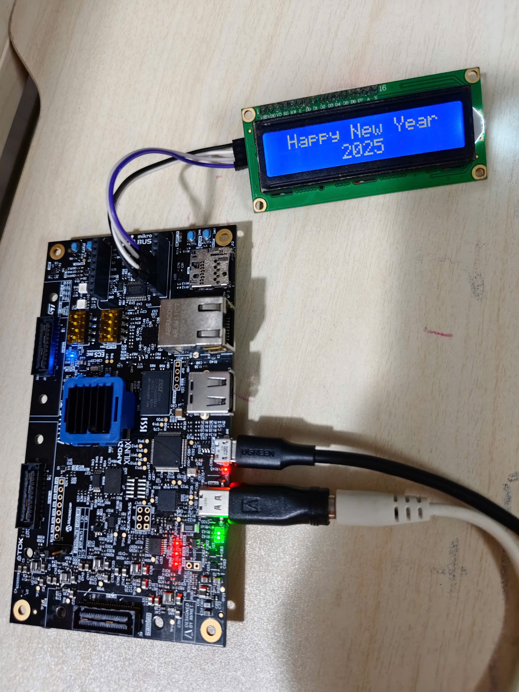
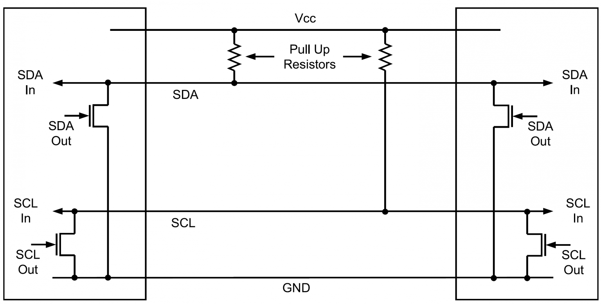
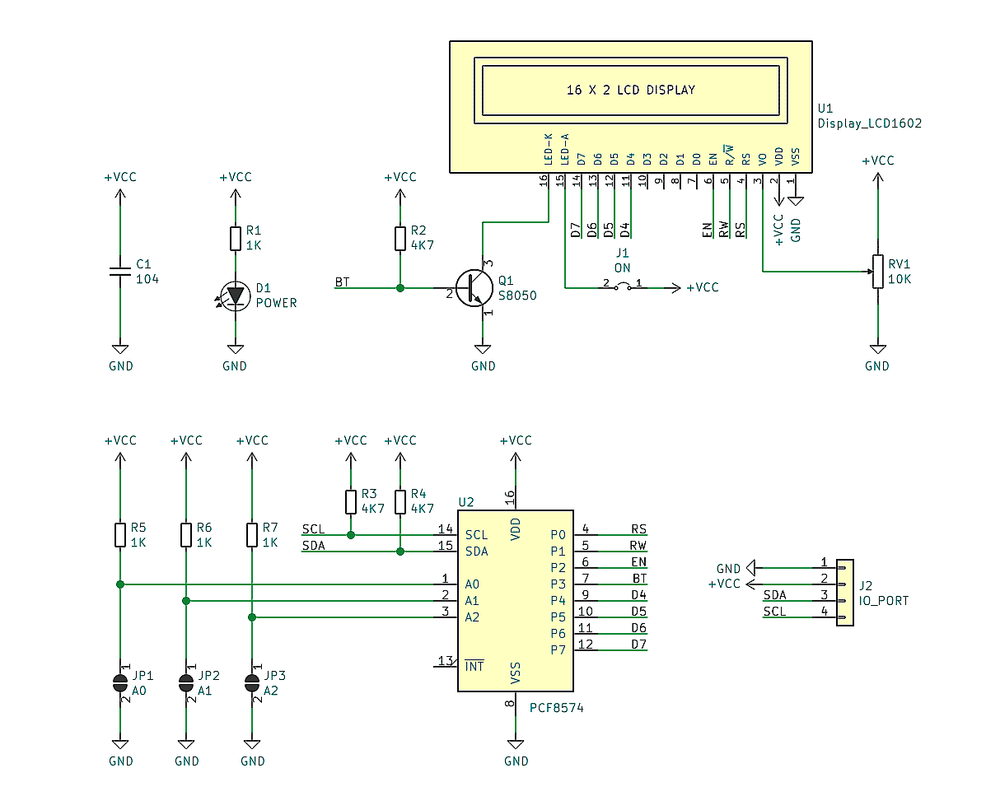

# LCD I2C Demo

Project demo giao tiếp Verilog với LCD qua giao thức I2C

## Tác giả

- **Name:** Võ Nhật Trường
- **Email:** truong92cdv@gmail.com
- **GitHub:** [truong92cdv](https://github.com/truong92cdv)

## Kết quả thành phẩm

## Thiết bị dùng trong project

- ZUBoard 1cg mã sản phẩm XCZU1CG-1SBVA484E
- LCD I2C module 16x2 (có tích hợp ic PCF8574 với địa chỉ là 0x27).
- 2 đường dây nối SDA và SCL, dây VCC +5V, dây GND.

## I2C protocol

Đọc thêm về giao thức I2C tại đây [I2C protocol](https://dayhocstem.com/blog/2020/05/giao-dien-ghep-noi-i2c.html).

Giao thức I2C gồm 2 đường tín hiệu: SDA và SCL. Tín hiệu SCL là tín hiệu xung clock do thiết bị Master tạo nhịp, tín hiệu SDA là dữ liệu truyền đi.
Khi Master muốn ghi dữ liệu vào Slave, sẽ trải qua các bước sau:
1. Master gửi tín hiệu START (kéo SDA từ high -> low khi SCL đang giữ mức high).
2. Master gửi địa chỉ Slave cần ghi (frame 8 bit gồm 7 bit addr + bit 0 để chỉ định write).
3. Slave so sánh địa chỉ, nếu trùng khớp, nó sẽ gửi tín hiệu ACK để sẵn sàng nhận dữ liệu từ Master (giữ SDA ở mức low khi SCL từ low -> high ở xung nhịp thứ 9).
4. Master gửi 1 byte data. Ghi từng bit vào SDA (MSB first) khi SCL chuyển từ low -> high.
5. Slave gửi tín hiệu ACK. Lặp lại bước 4 và 5 đến khi Master đã truyền xong dữ liệu.
6. Master gửi tín hiệu STOP (kéo SDA từ low -> high khi SCL đang giữ mức high).

Nên nhớ rằng đường tín hiệu SDA và SCL là 2 chiều, và phải được nối với điện trở pull-up (thường dùng 4.7k) để tránh xung đột tín hiệu. Khi Master hoặc Slave muốn kéo tín hiệu xuống low, nó phải gửi tín hiệu low. Còn khi muốn kéo tín hiệu lên high, chỉ cần giải phóng đường tín hiệu để pull-up làm nhiệm vụ kéo đường tín hiệu lên high.

Giao thức truyền nhận dữ liệu khi Master muốn ghi dữ liệu vào Slave:

Waveform mục tiêu cần đạt:

## Code explain

### clk_divider module

- Tạo clk 1 MHz (1 us) từ clk 100 MHz của ZUBoard.

### i2c_writeframe module

- Đầu tiên, tạo module i2c_writeframe để ghi 1 frame (địa chỉ hoặc dữ liệu).

- Xung clk đầu vào là 1MHz (1us).

- Cờ start_frame và stop_frame để báo hiệu frame hiện tại là frame đầu tiên (frame địa chỉ, thêm tín hiệu START) hay frame cuối cùng (thêm tín hiệu STOP).

- Tín hiệu SDA là 2 chiều, cần phải được khai báo theo kiểu tri-state buffer, kích hoạt bởi tín hiệu sda_en.

- Module i2c_writeframe là 1 FSM gồm 15 states, mục tiêu nhằm tạo được Waveform như hình phía trên.

- Testbench waveform:

- Để ý rằng frame đầu tiên có điều kiện START và frame cuối cùng có điều kiện STOP.

### lcd_write_cmd_data module

- module này nhằm gửi lệnh hoặc dữ liệu đến LCD theo chế độ 4 bit.

- Đọc thêm về giao tiếp LCD chế độ 4 bit ở đây [LCD 4bit mode](https://www.electronicwings.com/8051/lcd16x2-interfacing-in-4-bit-mode-with-8051).

- Các bước gửi lệnh hoặc dữ liệu bao gồm:
1. Set RS = 0 (gửi lệnh) hoặc RS = 1 (gửi dữ liệu).
2. Set RW = 0 (chế độ ghi).
3. Gửi 4 bit cao đến các chân D7 D6 D5 D4 của LCD.
4. Gửi 1 xung High -> Low đến chân EN của LCD để chốt dữ liệu.
5. Gửi 4 bit thấp đến các chân D7 D6 D5 D4 của LCD.
6. Gửi 1 xung High -> Low đến chân EN của LCD để chốt dữ liệu.

- Nên nhớ trước khi gửi dữ liệu, cần gửi các lệnh đến LCD để khởi tạo chế độ ghi 4 bit:
1. Lệnh 0x02: set 4 bit mode.
2. Lệnh 0x28: set LCD 16x2, 4 bit mode, 2 dòng, ký tự dạng 5x8.
3. Lệnh 0x0C: set Display ON, tắt con trỏ.
4. Lệnh 0x06: tự động tăng con trỏ khi ghi xong 1 ký tự.
5. Lệnh 0x01: xóa màn hình
6. Lệnh 0x80: Đưa con trỏ về đầu dòng 1.

- Ngoài ra, cần nắm được sơ đồ kết nối của module LCD I2C (gồm ic PCF8574):

- Module lcd_write_cmd_data là 1 FSM gồm 14 states, nhằm ghi các lệnh và dữ liệu vào LCD theo chế độ 4 bit như trên.

- Testbench waveform:

### lcd_display module

- Input gồm row1 và row2 là chuỗi ký tự cần hiển thị trên dòng 1 và dòng 2. Mỗi dòng 16 ký tự x 8 bit = 128 bit.

- Cần chú ý đoạn code genvar nhằm chuyển dữ liệu từ row1, row2 vào mảng cmd_data_array (40 byte). Mảng này chứa các lệnh cần ghi vào LCD:
1. Lệnh 0 -> 5:  các lệnh khởi tạo LCD.
2. Lệnh 6 -> 21: dữ liệu của dòng 1.
3. Lệnh 22: chuyển con trỏ xuống đầu dòng 2.
4. Lệnh 23 -> 38: dữ liệu của dòng 2.

Testbench waveform:

### top module

- Kết nối các module con lại, gán dữ liệu row1 và row2 cần hiển thị.

## Tham khảo

1. [i2c_protocol](https://dayhocstem.com/blog/2020/05/giao-dien-ghep-noi-i2c.html)
2. [lcd_4bit_mode](https://www.electronicwings.com/8051/lcd16x2-interfacing-in-4-bit-mode-with-8051)
3. [lcd_i2c_module](https://blog.csdn.net/qq_41795958/article/details/113649456)
4. [lcd_i2c_project](https://blog.csdn.net/xyx0610/article/details/121715973)
